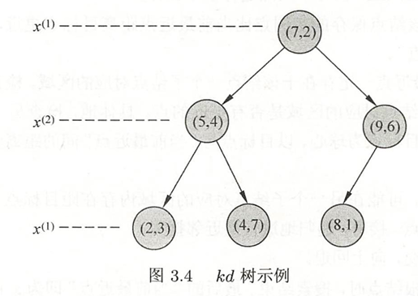

# ch03习题

## 题一

参照图3.1，在二维空间中给出实例点，画出k为1和2时的k近邻法构成的空间划分，并对其进行比较，体会k值选择与模型复杂度及预测准确率的关系。

解：略

## 题二

利用例题3.2构造的kd树求点x=(3,4.5)T的最近邻点。

解：

例题3.2中的的kd树为

根据kd树搜索的算法，我们首先要确定哪个叶节点包含该数据。

- 与根节点对比第一维，x应该在根节点的左子树
- 与（5，4）节点的第二维对比，x应该在（5，4）节点的右子树
- 因此我们找到了包含目标点x的叶节点（4，7）
- 设节点（4，7）为目标点的“当前最近点”
- 回退到上一个节点，判断是否比“当前最近点”更近，经过计算（4，7）节点距离为2.6926，（5，4）节点距离为2.0615，“当前最近点”更新为（5，4）
- 判断**以目标点为圆心，当前最短距离为半径的超球体**是否与**当前节点的另一子结点对应的区域**相交：当前最短距离为2.0615，在当前的划分维度下，目标点到当前节点的零一子节点对应的区域（最短距离）为0.5（当前节点划分方式为第二维，因此直接考虑第二维上的差距），有相交，因此需要判断当前节点的另一子结点是否有更近的节点
- 判断（2，3）节点是否更近，其距离为1.8028，比当前最短距离短，因此（2，3）为当前最短距离。
- 回退到根节点，判断根节点是否更近，其距离为4.7170，不需要更新
- 判断圆是否与另一子节点对应的区域相交：目标点到另一子结点对应区域的最短距离为4，大于最短距离，因此不需要搜索另一子结点对应的区域
- 最近邻居为（2，3），距离为1.8028

## 题三

参照算法3.3，写出输出为x的k近邻的算法。

解：

略

思路：用长度为k的列表存储最近的k个节点，列表未满之前直接追加到列表，每次判断是否要更新列表时使用列表中距离最长的节点来比较，其他与最近邻搜索类似。
